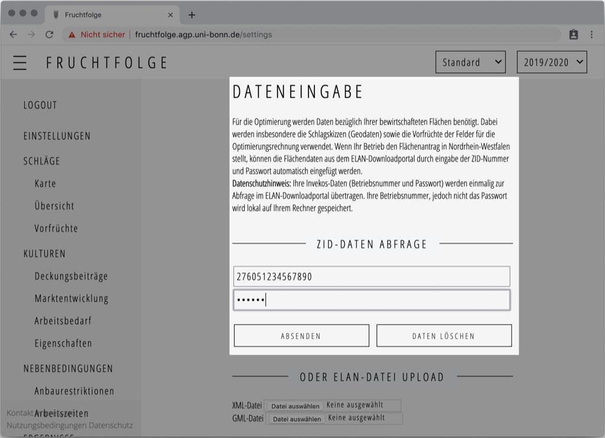
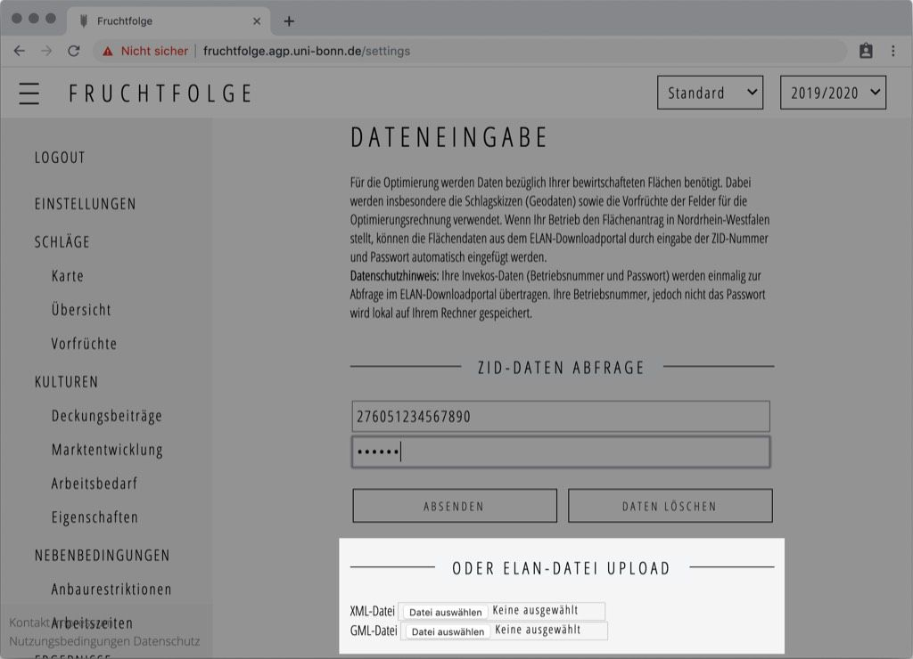

Auf der Seite [`Einstellungen`](http://fruchtfolge.agp.uni-bonn.de/settings) haben Sie die Möglichkeit, Daten über die von Ihnen bewirtschafteten Schläge und Kulturen aus Ihrem Flächenantrag zu importieren.

::: warning Hinweis
Der Import von Flächenantragsdaten ist aus technischen Gründen aktuell nur für **Nordrhein-Westfalen** verfügbar. Sie können die Anwendung jedoch auch verwenden, wenn Ihr Betrieb den Flächenantrag in einem anderen Bundesland stellt. In diesem Fall [übersprigen Sie dieses Kapitel](./add_plot.html).
:::

## Automatischer Import <Badge text="empfohlen"/>

Um die Daten automatisch aus dem Flächenantrag zu importieren, geben Sie Ihre **15-Stellige ZID Betriebsnummer** in das Eingabefeld mit dem Platzhalter *ZID-Betriebsnummer (27605...)* ein. Anschließend füllen Sie das Feld mit dem Platzhalter *Passwort* mit der zur ZID-Betriebsnummer gehörigen **6-Stelligen ZID-Pin** aus.

Drücken Sie nun auf die Schaltfläche **Absenden**. Die Daten werden automatisch vom [LWK-Downloadportal](https://www.lwk-verfahren.de/DownloadPortal/pages/loadPage.action) heruntergeladen und in die Fruchtfolge anwendung importiert.

::: danger Netzwerkfehler
In manchen Fällen schlägt der automatische Import fehl.
Überprüfen Sie in diesen fällen bitte die folgenden Dinge:
1. Sind Betriebsnummer und PIN korrekt ausgefüllt?
2. Lässt sich das [LWK-Downloadportal](https://www.lwk-verfahren.de/DownloadPortal/pages/loadPage.action) von Ihrem Gerät erreichen?
3. Wurde die Internetverbindung von Ihrem Gerät zurückgesetzt?

Wenn Sie diese Dinge überprüft haben, können Sie nach kurzer Zeit wiederholt auf die **Absenden** Schaltfläche drücken. Falls der Fehler bestehen bleibt, wären wir über eine [kurze Mitteilung](http://fruchtfolge.agp.uni-bonn.de/kontakt) dankbar! 
:::

## Manueller Import
Der manuelle Import von Flächenatragsdaten ist insbesondere für den Zeitraum zwischen der Antragsstellung im Frühjahr und der Bereitstellung der Daten im LWK-Downloadportal zum 01.09 des Jahres geeignet. Gleichtzeitig können Sie den manuellen Import nutzen, wenn Sie Ihre ZID-Betriebsnummer und PIN nicht angeben möchten.

Die erforderlichen `.xml` und `.gml` Dateien für die vergangenen Antragsjahre können Sie dabei aus dem [LWK-Downloadportal](https://www.lwk-verfahren.de/DownloadPortal/pages/loadPage.action) beziehen. Eine Anleitung zur Benutzung des Downloadportal finden Sie auf den [Seiten der Landwirtschaftskammer-NRW](https://www.landwirtschaftskammer.de/foerderung/elan/faq-downloadportal.htm)

Den Flächenantrag für das aktuelle Antragsjahr (zwischen Antragsstellung und 01.09 des Jahres) können Sie direkt aus dem Antragsprogramm [ELAN-NRW](https://www.elan-nrw.de/webClient_NW/) herunterladen. Eine detaillierte Anleitung für den Export findet beispielsweise auf der [Website von topfarmplan](https://www.topfarmplan.de/elan-flaechenantrag-ackerschlagkartei-flaechenimport/#nrw).

Wenn Sie die Antragsdaten heruntergeladen haben, können Sie diese nun importieren.
Klicken Sie dafür zunächst auf den Button **Datei auswählen** neben dem Text *XML-Datei* um das jeweilige Flächenverzeichnis mit der Dateiendung `.xml` hochzuladen. Beachten Sie dabei, dass Sie Daten von jeweils nur einem Antragsjahr gleichzeitig hochladen können.  
Anschließen klicken Sie auf den Button **Datei auswählen** neben dem Text *GML-Datei* um die Schlaggeometrien des jeweiligen Antragsjahr hochzuladen. Wenn Sie beide Dateien ausgewählt haben, beginnt der Import automatisch.

